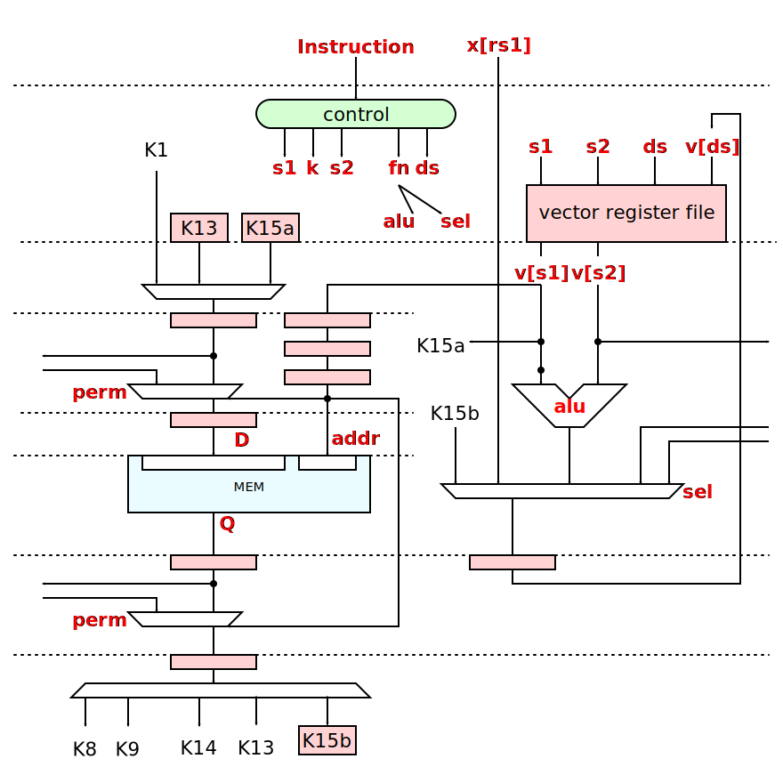

**Xbaseband** RISC-V custom instruction extensions to accelerate complex
baseband DSP operations.
Used inside [Q-engine](https://github.com/siglabsoss/q-engine)

## Resources

# Get Started

* install verilator according to [Ubuntu Instructions](https://FIXME/wiki/Setup_Verilator_On_Ubuntu)
* Install the tar.gz according to: https://github.com/SpinalHDL/VexRiscv#build-the-risc-v-gcc
  * or you can compile it yourself
* clone this repo and:

```sh
cd cpp/first_try
make
ls build/atomic.hex  # this is the softcore firmware
cd ../../
make
make show
```

# How it works
This repo has a custom compiled output of https://github.com/SpinalHDL/VexRiscv  We verilate that soft-core `hdl/generated/VexRiscv.v` in our own tools and feed it compiled hex code.  We will add external vector-multipliers controlled by custom asm instructions.

**Xbaseband** extension makes following resources visible to the programmer:


### Parameters

This document uses the following parameters:

#### XBB16

  * VLEN = 16; current width of an V register in bits.
  * KLEN = 32; current width of a K register in bits
  * NREGS = 16; number of vector registers.
  * NSLICES = 16; number of instantiated slices

#### XBB32

  * VLEN = 16; current width of an V register in bits.
  * KLEN = 32; current width of a K register in bits
  * NREGS = 16; number of vector registers.
  * NSLICES = 32; number of instantiated slices

## ISA


```c
v[ds] = v[s1] <funct> v[s2]; scratch[k] = v[s1];
```

## Block Diagram



Each vector slice structure:

  * [Vector register file](#vector-register-file)
  * [Vector ALU](#vector-alu)
  * [Vector Memory](#vector-memory)
  * [Load permutation network](permutator.md) performs reshuffling
of each bundle of data from memory into scratch pad;
  * [Scratch Pad](#scratch-pad) is the register file that acts as temporary
storage for the data processed by the **DAT**;
  * [Store permutation network](permutator.md) performs
reshuffling of each bundle of outgoing data similar to the previous item;

### Vector Register File

Vector Register file has `NREGS` vector data registers (vN).
Each register pack together `NSLICES` numbers of specific of `VLEN` precision.

### Vector ALU

| code | vop             | description                |                                                                                      |
|:----:|:----------------|:---------------------------|:-------------------------------------------------------------------------------------|
|  0   | NOP             |                            |                                                                                      |
|  1   | ADD(ds, s1, s2) | Addition                   | `v[ds] = (x[rs1][i]) ? v[ds] : {v[s1].perm + v[s2].perm, v[s1].baddr + v[s2].baddr}` |
|  2   | SUB(ds, s1, s2) | Subtraction                | `v[ds] = (x[rs1][i]) ? v[ds] : {v[s1].perm - v[s2].perm, v[s1].baddr - v[s2].baddr}` |
|  3   | AND(ds, s1, s2) | bitwise AND                | `v[ds] = (x[rs1][i]) ? v[ds] : (v[s1] & v[s2])`                                      |
|  4   | OR(ds, s1, s2)  | bitwise OR                 | `v[ds] = (x[rs1][i]) ? v[ds] : (v[s1] or v[s2])`                                     |
|  5   | XOR(ds, s1, s2) | bitwise XOR                | `v[ds] = (x[rs1][i]) ? v[ds] : (v[s1] ^ v[s2])`                                      |
|  6   | MV(ds, s2)      | Move                       | `v[ds] = (x[rs1][i]) ? v[ds] : v[s2]`                                                |
|  7   |                 |                            |                                                                                      |
|  8   | ROL(ds, s2)     | Left Circular Shift        | `v[ds] = (x[rs1][i]) ? v[ds] : v(i-1)[s2]`                                           |
|  9   | ROR(ds, s2)     | Right Circular Shift       | `v[ds] = (x[rs1][i]) ? v[ds] : v(i+1)[s2]`                                           |
|  A   | MV_X_V(ds, rs1) | Move from RiscV into Slice | `v[ds] = x[rs1]`                                                                     |
|  B   | MV_K15_V(ds)    | Move from K15b             | `v[ds] = (x[rs1][i]) ? v[ds] : K15b`                                                 |
|  C   |                 |                            |                                                                                      |
|  D   |                 |                            |                                                                                      |
|  E   |                 |                            |                                                                                      |
|  F   | MV_V_K15(s2)    | Move into K15a             | `K15a = v[s2]`                                                                       |

### Vector Memory

#### Memory map

Each slice instruction generates address for own memory slice.

Memory map is divided into multiple logical regions with different properties.

Logical regions are mapped to the same (smaller) physical memory.

* **Bank Address** directly used as word address inside own memory slice;
* **permutation** controls permutation network

##### XBB16

Total physical memory:
`16 banks x 4096 depth x 32 bit = 256 KiB`

When used as address, vector register has the following format:


##### XBB32

Total physical memory:
`XBB32 = `32 banks x 2048 depth x 32 bit = 256 KiB`

When used as address, vector register has the following format:


### Scratch Pad

The **Scratch Pad** is the unit inside **DAT** sub-module. The purpose
of the *Scratch Pad* is to realign the unified vector memory access data stream
into multiple data streams required by *Systolic Array*. Aggregative throughput
of all incoming / outgoing and *Systolic Array* data streams should be harmonized
with unified memory access data throughput to achieve the performance.

The software developer see the *Scratch Pad* as the register file. C program
describes the order of Scratch Pad Load / Store instruction. ENGINE can issue one
Scratch Pad Load or Store instruction per cycle. Each Load / Store instruction
will be executed in the pipeline.


#### Scratch Pad register map

The `k` field of instruction word controls operations with scratch pad registers.

  * `0` - nop
  * `1-7` - store register to memory
  * `8-15` - load register from memory

Some scratch pad registers are attached to the systolic data path:
  * `k1` - dataPath output
  * `k9, k9` - dataPath inputs
  * `k13` - dataPath bypass
  * `k14` - dataPath configuration word
  * `k15a, k15b` - vector register bank load / store path

| code | asm  |      operation       | Note                        | datapath |
|:----:|:----:|:--------------------:|:----------------------------|:---------|
|  0   | KNOP |         nop          |                             |          |
|  1   | SK1  |  `vmem(v[s1]) = k1`  | store K1                    | i0       |
|  2   |      |                      |                             |          |
|  3   |      |                      |                             |          |
|  4   |      |                      |                             |          |
|  5   | SK13 | `vmem(v[s1]) = k13`  | store K13                   |          |
|  6   |      |                      |                             |          |
|  7   | SK15 | `vmem(v[s1]) = k15a` | store K15a                  |          |
|  8   | LK8  |  `k8 = vmem(v[s1])`  | load K8                     | t0       |
|  9   | LK9  |  `k9 = vmem(v[s1])`  | load K9                     | t1       |
|  A   |      |                      |                             |          |
|  B   |      |                      |                             |          |
|  C   |      |                      |                             |          |
|  D   | LK13 | `k13 = vmem(v[s1])`  | load K13                    |          |
|  E   | LK14 | `k14 = vmem(v[s1])`  | load dataPath configuration | cfg      |
|  F   | LK15 | `k15b = vmem(v[s1])` | load K15b                   |          |

## Extending RISC-V

### RTL

[VexRiscv](https://github.com/SpinalHDL/VexRiscv#add-a-custom-instruction-to-the-cpu-via-the-plugin-system)

### Assembler

We would like to use macros in a smart way to glob bit-fields together to form 32 bit instructions.  We can look to boost's pre-processor for examples:
* http://www.boost.org/doc/libs/1_66_0/libs/preprocessor/doc/ref/comma_if.html

[VexRiscv](https://github.com/SpinalHDL/VexRiscv/blob/master/src/test/cpp/custom/simd_add/src/crt.S)


### C

The `first_try` folder has an compiling example of running c code which is very simple.

* [RISCV Compiler explorer](https://cx.rv8.io/)
* [Intrinsic functions](https://en.wikipedia.org/wiki/Intrinsic_function) ?
* [Example of adding Intrinsics to GCC](http://people.ac.upc.edu/alvarez/media/gcc-isa-extensions.html)
* [newlib port to riscv](https://github.com/riscv/riscv-newlib) We probably don't want this but this project has some example of useful asm

## Steps to generate soft-core
* **do not run the following project inside your encrypted home directory!**
* follow https://github.com/SpinalHDL/VexRiscv/blob/master/README.md
* Run:
```sh
sbt "run-main vexriscv.demo.GenFullNoMmuNoCache"
ls VexRiscv.v
```

## References

  1. RISCV Spec :  [riscv-spec-v2.2](https://content.riscv.org/wp-content/uploads/2017/05/riscv-spec-v2.2.pdf)
  2. VexRiscv : https://github.com/SpinalHDL/VexRiscv
  3. [C Kozyrakis. Scalable vector media-processors for embedded systems](http://digitalassets.lib.berkeley.edu/techreports/ucb/text/CSD-02-1183.pdf)

## CSRs

#### SATDETECT:
* The register keeps track of the number of clipped samples and the time elapsed since the last read.
* The upper 16 bits of the register hold the clipped samples count and the lower 16 bits hold the clock cycles elapsed since last read
* When the timer counter rolls over, it resets the clipped sample count. This is not an issue b/c the register is expected to be read faster than the roll-over time.
