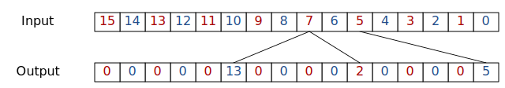

# Data Permutation Network

  * Two identical permutation networks
    * Load network `memory --> datapath`
    * Store network `datapath --> memory`

## Theory of Operation

The data comes to the input of *permutation network* as a bundle containing `N`
words of `W` bit each. The result of *permutation network* will contain
combination of input data words. Some data words can be duplicated, some words
can be missing, but no new data words can appears in the result that was not a
part of input bundle. The **permutation descriptor** is a bundle of `N` words of
`log2(N)` bit each contains the difference between the source index and the
destination index. The permutation descriptor is a part of *LAW* word.

The Figure *permutations* shows the example when most of the words has no
permutations and descriptor set to 0 for them. Tree non-zero descriptor slots
creates 3 more copies of words 4, 9, 15 in slots 7, 10, 13.

|  |
|:-----------------------------------------|
| Permutation encoding                     |

## ToDo
  * Topology
    * Global
    * Omega
    * Benes
  * Pipeline
