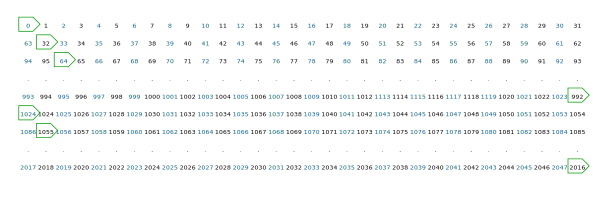
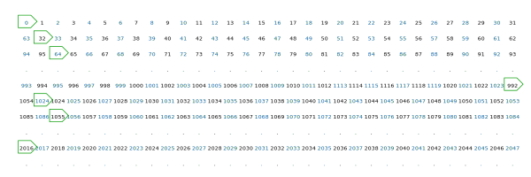
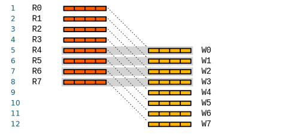
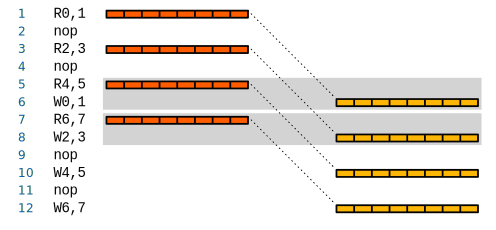
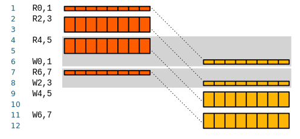
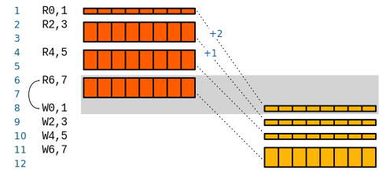
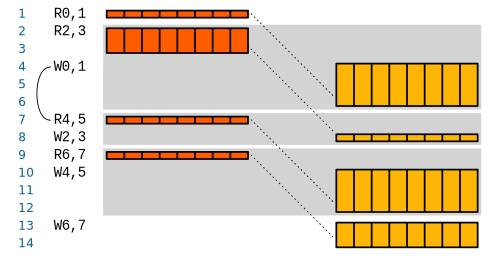

# Vector Memory

**Xbaseband** *vector memory* uses **interleaved** memory witch consist of
several memory **banks**. Interleaved memory improve memory bandwidth by
allowing elements in distinct banks to be accessed in an overlapped manner.
However, the actual bandwidth of the memory system may be less then the peak
bandwidth because of **conflicts**. A bank conflict occurs when the processor
request more then one element from one bank in the same cycle. The problem of
conflicts in interleaved memory has been the subject of intensive study
[[Sohi1993high]](#sohi1993high).

*Xbaseband32* has `M` single port memory banks, where `M = 32`. Each bank has
`N` elements. The total memory size is `M * N` of elements. Each element is 32
bit word.

Data array has to be allocated in the memory using one of the interleaving
schemes See Chapter 1: [Allocation](#allocation) for more details.

The processing on *reconfigurable datapath* (datapath) required data streaming
through it. The data path itself has only limited temporary memory to store
local scope of variables. Apart from the some data that can be reused for
multiple independent calculations the rest of data need to be retrieved from the
*vector memory*. Output of *datapath* in most of the cases has to be stored back
to the *vector memory*. It is essential to organize continuous data stream
through the *datapath*. It is also important to match memory read/write
throughput with the *datapath* throughput.

The sequence of read / write transactions has to be scheduled in the most
appropriate way to keep *datapath* busy. **Xbaseband** instruction extension
designed to synthesize the arbitrary schedule in real time. See Chapter 2:
[Scheduling](#scheduling) for more details.

## Allocation

Data array has to be allocated in the memory using one of the interleaving
schemes.

### Low-order scheme

The simplest and most common interleaving scheme is *low-order* or *standard*
scheme, uses low-order `m = log_2(M)` bits of the address to select the bank
and `n = log2(N)` bits to select the word within the bank. For such an
interleaving scheme, the bank number in which an arbitrary address `i` is
located is specified by `i % M` and the word within the bank for the address
`i` is `i / M`. Successive elements in the linear memory address space are
placed in successive banks.

If an interleaving scheme uses the low-order `p` bits to select the bank,
address `(2^p * l + m)` where `l` is an integer greater than `0` and `0
=< m =< 2^p-1` will map on to the same bank as address `m` and, therefore,
the distribution pattern of addresses among the banks will repeat after `2^p`
elements.

In a standard interleaved memory, successive components of a vector with stride
1 fall in successive banks and can be accessed in a conflict-free fashion.
However, successive components of a vector with stride `M` lie in the same bank
and will result in conflicts.

### High-order scheme

Other interleaving schemes that use an arbitrary, but known, `n` bits of the
address to select the bank and the remaining `N - n` bits of address to select
the word within the bank are also possible.

For example, a *high-order* interleaving scheme would use the high-order `n`
bits of the address to select the bank and the low-order `N - n` bits of the
address to select the word with the selected bank. However, they are not as
popular as a standard interleaving scheme for vector processors because they do
not allow for peak-throughput access to a vector of stride 1.

<!--
### Reshaped

If the access patterns and the size of the data structures are known a priori at
compile time, array *reshaping* techniques can be used to minimize the
possibility of memory bank conflicts. Array reshaping involves the embedding of
an array in a larger array in an attempt to make the stride of access relatively
prime to the number of banks. Memory bank conflicts for common reference
patterns are reduced at the expense of wasted memory.
-->

### Skewed schemes

Researchers have long realized the inadequacy of a standard interleaving scheme
for parallel memory systems. To reduce the probability of conflicts, data
skewing schemes were introduced. Several data skewing schemes have been proposed
and analyzed in the literature. In a memory system with a data skewing scheme,
the mapping from the linear address space to the banks of the memory system is
specified by the skewing scheme.

Any interleaving scheme which uses a mapping function from the linear address
space to the memory banks other than the mapping function used in standard
interleaving shall be called an *alternate interleaving* scheme.

#### Linear data skewing

One of the first alternate interleaving schemes, linear data skewing schemes,
were proposed for parallel memories.

<!-- in [TBD] and analysed in [TBD] and [TBD]. -->

In a linear skewing scheme, element `a[j,k]` of a two-dimensional array `A` is
stored in memory bank `j * delta_1 + k * delta_2` where `delta_1` and `delta_2`
are integers [TBD]. The scheme generalizes for higher dimension arrays. However,
to implement a linear skewing scheme, the bank selection hardware needs the
capability to carry out arithmetic operations. The time taken to carry out
arithmetic operations can easily degrade the latency of each memory request.

<!--
#### XOR

To simplify the implementation (eliminate the need for arithmetic operations),
Frailong, Jalby, and Lenfant presented a family of interleaving schemes called
*XOR schemes* or *Boolean* schemes for parallel memories [TBD]. Such schemes
rely on cheaper, bit-wise Boolean operations to determine the memory module for
an arbitrary address. Melton and Norton have shown how such schemes can be used
to achieve conflict-free access to power-of-two strides in the IBM RP3 processor
[TBD].

Traditionally, data skewing schemes were studied for parallel memories in SIMD
array processors. However, Harper and Jump proposed and studied a linear data
skewing scheme for an interleaved memory in a vector processor [TBD].
-->

#### 1-Skew

In the 1-Skew interleaving scheme proposed by Harper and Jump, the bank number
`M_i` for an arbitrary address `i` in the linear memory is calculated as:

If `M` is a power of two `(M =2^n)`, the division and modulo operations are
trivial and the bank number calculation involves a single n-bit addition.

Consider the distribution of 2048 elements (64 linear subvectors of 32 elements
each) from the linear address space amongst 32 banks using a 1-Skew storage
scheme (see Figure *oneskew32*).

|                      |
|:---------------------------------------------|
| Distribution of elements using 1-Skew scheme |

The elements of a subvector that comprises word `k` in the memory banks are
distributed in a regular fashion, i.e., the only difference between word `0` and
word `k` is that the first element of word `k` is placed in bank `k(mod 2^n)`.
Furthermore, since only `2n = 10` bits of the address are used to compute the
bank, the distribution pattern repeats after `2^(2n) = 2^(10) = 1024` elements
(see Figure *oneskew32*).

When compared to a standard interleaving scheme, the 1-Skew scheme eliminates
conflicts for strides such as stride 8 but introduces conflicts for some other
strides, for example, stride 14.

The 1-Skew interleaving scheme (or any other scheme that uses linear data
skewing) has an inherent disadvantage - it involves arithmetic manipulation of
the address bits. However, the performance advantage of 1-Skew interleaving over
standard interleaving suggests that an alternate interleaving scheme in memory
systems for vector processors may be worthwhile. This arithmetic manipulation
done by Xbaseband.

#### 1-Skew plus

It is possible to extend the 1-Skew scheme presented in
Section *oneskew* to a linear skewing scheme that uses more than 2n
bits to select the bank. For example, a linear skewing scheme in which the bank
number (Mi) for an arbitrary address i is calculated as:

|                      |
|:--------------------------------------------------|
| Distribution of elements using 1-Skew plus scheme |

<!--

### Further considerations

However, the degradation due to many of the conflicting strides can be reduced
or even eliminated if buffers are provided at the input and the output of each
memory module.

For example, if 3 buffer elements are provided at the input and the output of
each memory bank, stride 14 accesses can proceed at the rate of 1 element per
cycle (see analysis in Section TBD).

Likewise, stride 7 accesses can proceed at the rate of 1 element per cycle if 6
buffer elements were provided at the input and output of each memory module.
Harper and Jump provide a detailed analysis on the number of buffers that is
needed in [TBD].

Before proceeding further, let us distinguish between **conflict-free** and
*peak-throughput* access. Conflict-free access occurs when references to the
same memory bank do not occur within a time window determined by the bank busy
time.

Indeed, most alternate interleaving schemes presented in the literature
are concerned with conflict-free access to a particular set of strides. If no
conflicts occur in accessing data, the data accesses can proceed at the maximum
rate allowed by the memory system, i.e., with peak-throughput.

<!--
However, peak-throughput access is possible even if the accesses are not
conflict-free (see, for example, analysis for strides 7 and 14 of Fig. 1 in
Section V-B). If a conflict situation occurs and the conflicting request can be
buffered, succeeding requests might be able to proceed allowing peak-throughput
access [2], [6].
-->

Since conflict-free access to a wide variety of strides is not possible, one can
attempt to improve the throughput for a wide variety of strides by using
alternate interleaving schemes. Ideally, the interleaving scheme would minimize
the possibility of a long sequence of accesses to the same bank.

Then, by providing buffers, memory requests can be allowed to proceed even
though previous requests may be waiting (in the buffers) for a memory bank to
become free.

However, keep in mind that the interleaving scheme should be simple enough that
its implementation does not degrade the latency of each memory request.

<!--
Fortunately, interleaving schemes that involve bit-wise logical operations on
the address bits seem to fit the above-mentioned requirements and therefore we
shall investigate their use in a high-bandwidth interleaved memory system.

We shall refer to such schemes as Permutation-Based Interleaving (PBI) schemes
and the resulting memory system as a Permutation Interleaved (PI) memory system.
-->

## Scheduling

The sequence of read / write transactions has to be scheduled in the most
appropriate way to keep *datapath* busy. **Xbaseband** instruction extension
designed to synthesize the arbitrary schedule in real time.

The FlowWare is the part of SoftWare describing the schedule for read/write
transactions in the most appropriate way to keep *datapath* busy. The
*Xbaseband* instruction extension and *vector slice units* is the part of
processor that has specific resources to synthesize the arbitrary schedule in
real time. *vector slices* include specific registers, arithmetic, logic and
instructions to perform all necessary operations.

## Transactions Scheduling

Let's discuss several practical schedules to demonstrate the corner cases and
elasticity mechanisms by example.

### Naive schedule

The naive FlowWare schedule shown on the figure below.

|  |
|:------------------------------------------|
| Naive FlowWare schedule                   |

For example: the *datapath* accepts 4 input values and produce 4 results with 4
cycle latency. In cycles (1...8) the processor issues 8 bundled read transaction
requests, and in cycles (5...12) the processor will request 8 write bundled
transactions. The read and write transactions has overlap in cycles (5...8).
This can cause potential memory access conflict when schedule required
read/write access to the same memory. This conflict could be partially addressed
by dual-port memory organization or by allocation the values into physically
different memory banks.

### Bundled transactions

Next example on the figure below shows how memory access conflict can be avoided
by bundling 8 transactions (read or write) per cycle.

|  |
|:-------------------------------------|
| Interleaved schedule with nops       |

One can notice that the total memory access throughput is the same as in
previous "Naive" example. The main difference that processor can issue only one
bundled access transaction per cycle. The extra buffer between memory and
*datapath* required because half of the retrieved value bundle can't be consumed
by *datapath* immediately. The execution time remains the same but
processor has empty slots in cycles 2, 4, 9, 11 that can be used by
aside memory transactions.

### Back-pressure

The compiler can schedule other useful instructions instead of NOPs but it also
can skip NOP instructions. If, for some reason, the scheduled transaction can't
be completed then *vector memory* produce back-pressure signal that help to
reduce the code size and keep the results correct.

Figure below shows the case when 8 instructions were executed 12 cycles because
read transactions (R2,3 and R4,5) and write transactions (W4,5 and W6,7) were
back-pressured.

|         |
|:----------------------------------------|
| Interleaved schedule with back-pressure |

The input buffering insight *datapath* will postpone back-pressure event but not
always will speed-up the execution.

### Result readiness

All examples above were examining a case when the order of read and write
transactions is optimal for specific *datapath* latency. It can be multiple
cases when the ideal schedule order isn't practically achievable. Some
transactions rearrangements can be essential or useful.

Next example on Figure *interleavelatew* shows what will happens
when the write transaction where scheduled late.

|                        |
|:-------------------------------------------------------------------|
| Interleaved schedule with back-pressure and late Write transaction |

If the read/write transactions not aligned perfectly so that write transaction
schedule shifted late relatively to read transaction schedule, then the data on
the output of *datapath* wasn't stored when it is immediately available.

Some order of *datapath* elasticity in form of output buffer will be very
helpful. Otherwise the read transaction (R6,7) will be deadlocked by absent
write transaction (W0,1).

### Pipeline bubble

The *datapath* will be inactive if no transactions scheduled. That is the case
when input data is not in a place or engine busy with other operations. It is
also the case when write transaction (W0,1) was scheduled too early and next
read transaction (R4,5) was postponed as shown on the Figure *interleavelater*.
In the example above one can see that wrong schedule cause 2 extra cycles of
execution. Such read/write miss-alignment within basic block will cause
throughput degradation.

|                            |
|:------------------------------------------------------------------|
| Interleaved schedule with back-pressure and late Read transaction |

## References

### Sohi1993high
[High-Bandwidth Interleaved Memories for Vector Processors-A Simulation Study](https://pdfs.semanticscholar.org/486c/a2461feccfd2976f94b86f7210b3a62ae74d.pdf)
